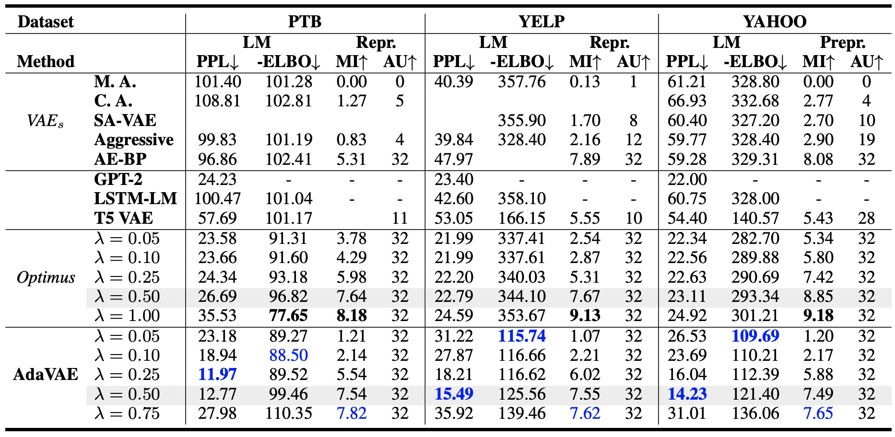
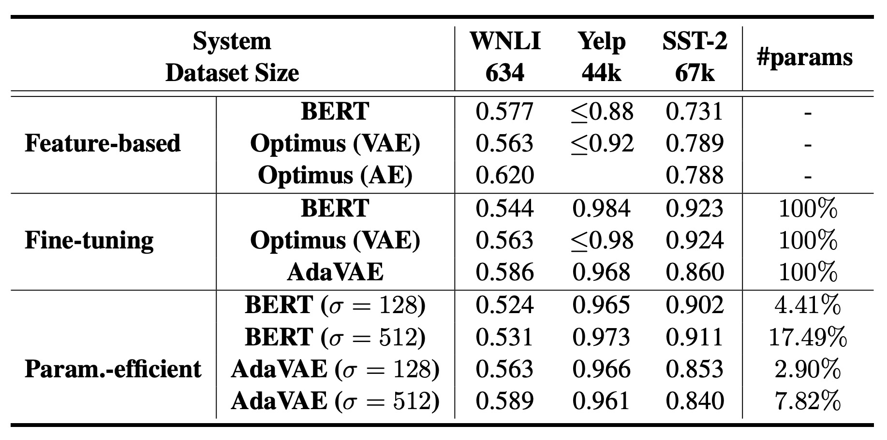

# AdaVAE: Exploring Adaptive GPT-2s in VAEs for Language Modeling

**[Repo In Progress]** Official implementation for **AdaVAE**, check the paper on arxiv [https://arxiv.org/pdf/2205.05862.pdf](https://arxiv.org/pdf/2205.05862.pdf).

## Setup

make sure that you have installed:

```
transformers==3.1.0
torch
tensorboard
tqdm
apex [from https://github.com/NVIDIA/apex]
nltk
```

## Datasets

- Language Modeling: yelp, yahoo, snli, ptb from [`download_datasets.md`](https://github.com/ChunyuanLI/Optimus/blob/master/data/download_datasets.md) in Optimus. Put them in the `./data/optimus_dataset` folder. 
- Low Resource Text Classification: yelp polarity dataset from [Shen et. al.](https://github.com/shentianxiao/language-style-transfer), and put it to `./data` folder directly. SST-2 and WNLI from GLUE, use [`download_glu_data.py`](https://github.com/ImKeTT/adavae/blob/main/low_nlu/download_glu_data.py) to download them, and put both datasets in the `./glue_data` folder.
- Controllable Text Generation: yelp polarity dataset from [Shen et. al.](https://github.com/shentianxiao/language-style-transfer), and put it to `./data` folder directly.
- Text Generation via Latent Manipulation: Any dataset mentioned above with pre-trained model weights in Language Modeling task.

Make sure that all data folders contain `train.txt`, `test.txt`, `valid.txt` files.

## Dependencies

```
adavae
|____low_nlu
| |____run_cls.sh
| |____latent_classifier.py
| |____utils_glue.py
| |____...
|____controlgen
| |____oracle_cls.py
| |____run.sh
| |____run_vae_ctrl_gen.py
| |____...
|____README.md
|____dialogue
| |____run_spacefusion_gen.py
| |____...
|____data
|____src
| |____test.py
| |____adapters
| | |____vae.py
| | |____...
| |____adaVAE.py
| |____run_manipulation.sh
| |____run_lm.sh
| |____test.py
| |____...
```

## Tasks

### Language Modeling



Run language modeling task by `bash src/run_lm.sh`, change arguments accordingly.

### Low Resource Text Classification



Run classification task by `bash low_nlu/run_cls.sh`, change arguments accordingly.

### Controllable Text Generation

Before conducting controllable text generation , you need to:

1. Pre-train an oracle classifier for controllability evaluation by `python controlgen/oracle_cls.py`.
2. Pre-train the AdaVAE model with Language Modeling task and load the weights.

Finally run controllable text generation task by `bash controlgen/run.sh`, change arguments accordingly.

### Text Generation via Latent Manipulation

Run manipulation or analogy generation by `bash src/run_manipulation.sh`, the default dataset for this task if yelp polarity dataset. 

### Visualization

TBD.

### Dialog Generation

TBD.

### Model Testing

TBD. [Check `src/test.py` for more information]


## Others

Please email me or open an issue if you have any question.

if you find our work useful, please cite the paper :>

```
@article{tu2022adavae,
  title={AdaVAE: Exploring Adaptive GPT-2s in Variational Auto-Encoders for Language Modeling},
  author={Tu, Haoqin and Yang, Zhongliang and Yang, Jinshuai and Zhang, Siyu and Huang, Yongfeng},
  journal={arXiv preprint arXiv:2205.05862},
  year={2022}
}
```

We thank open sourced codes related to VAEs and parameter-efficient methods, which inspired our work !!